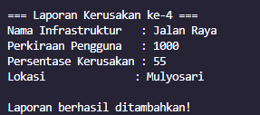

# 🏗️ Program Laporan Kerusakan Infrastruktur
# ⁉️Partition a linked list around a given value
## 📌 Deskripsi Problem
**Banyaknya Laporan mengenai fasilitas umum mengalami kerusakan**, tetapi tidak ada sistem yang efektif untuk **memprioritaskan perbaikannya**. Hal ini menyebabkan infrastruktur dengan tingkat kerusakan tinggi sering terabaikan, hal ini tentu membuat permasalahan yang seharusnya diselesaikan dengan se-segera mungkin malah tertunda dan terabaikan mengakibatkan ketidak nyamanan pengguna.

## 📌 Deskripsi Case-based Project 


Program ini merupakan sistem laporan kerusakan infrastruktur yang memprioritaskan perbaikan berdasarkan **persentase kerusakan**.

- **Infrastruktur dengan persentase kerusakan lebih tinggi dari ambang batas (50%)** akan **diperbaiki lebih dulu**, diurutkan dari yang paling rusak.
- **Infrastruktur dengan persentase kerusakan lebih rendah atau sama dengan ambang batas** akan **diperbaiki berdasarkan urutan laporan**.
- **Infrastruktur prioritas tinggi (Kerusakan >= 50%) akan kembali di prioritaskan berdasarkan perkiraan jumlah pengguna harian, jadi infrastruktur dengan pengguna terbanyak akan di prioritaskan.**


Program ini menyediakan menu untuk **menambahkan laporan, menampilkan daftar infrastruktur setelah dipartisi, serta menampilkan daftar berdasarkan urutan laporan**.

---

## 🚀 Fitur Program

1. **Tambah Laporan** → Pengguna dapat menambahkan data infrastruktur baru (Nama, Perkiraan Pengguna Harian, Persentase Kerusakan, Lokasi)
2. **Tampilkan Daftar Infrastruktur (Setelah Dipartisi)** → Menampilkan daftar yang telah diurutkan berdasarkan prioritas perbaikan.
3. **Tampilkan Daftar Infrastruktur Berdasarkan Urutan Laporan** → Menampilkan daftar infrastruktur berdasarkan urutan laporan masuk.

---

## 📜 Cara Kerja Program

1. **Input Data Infrastruktur**

   - Saat laporan baru masuk, diberikan **nomor urut laporan**.
   - Data yang dimasukkan mencakup **Nama Infrastruktur, Perkiraan Pengguna Harian, Persentase Kerusakan, dan Lokasi**.

2. **Partisi Infrastruktur Berdasarkan Persentase Kerusakan**

   - Jika `Persentase Kerusakan >= 50%`, infrastruktur masuk dalam daftar prioritas tinggi.
   - Jika `Persentase Kerusakan < 50%`, infrastruktur tetap dalam urutan laporan biasa.
   - Infrastruktur dalam daftar prioritas tinggi **diurutkan berdasarkan persentase kerusakan tertinggi ke terendah**.

3. **Menampilkan Data Infrastruktur**

   - **Menu 2** → Menampilkan daftar yang telah dipartisi.
   - **Menu 3** → Menampilkan daftar berdasarkan urutan laporan masuk.

---

## 🛠 Struktur Data

Program menggunakan **Linked List** untuk menyimpan laporan infrastruktur:

```cpp
class Node {
public:
    int laporanKe;
    string namaInfrastruktur;
    int penggunaHarian;
    int persentaseKerusakan;
    string lokasi;
    Node* next;

    Node(int id, string nama, int pengguna, int kerusakan, string lok) {
        laporanKe = id;
        namaInfrastruktur = nama;
        penggunaHarian = pengguna;
        persentaseKerusakan = kerusakan;
        lokasi = lok;
        next = NULL;
    }
};
```

---
## 📌 Algoritma Partition Data

Laporan infrastruktur akan dipisahkan ke dalam dua kelompok berdasarkan ambang batas persentase kerusakan menggunakan **Linked List Partitioning**:

```cpp
Node* partition(Node* head, int x) {
    Node* highHead = new Node(0, "", 0, 0, ""), *high = highHead;
    Node* lowHead = new Node(0, "", 0, 0, ""), *low = lowHead;
    
    Node* curr = head;
    while (curr) {
        if (curr->persentaseKerusakan >= x) {
            high->next = curr;
            high = high->next;
        } else {
            low->next = curr;
            low = low->next;
        }
        curr = curr->next;
    }
    
    high->next = nullptr;
    low->next = nullptr;
    
    bubbleSort(highHead->next);
    
    high->next = lowHead->next;
    Node* newHead = highHead->next;
    
    delete highHead;
    delete lowHead;
    
    return newHead;
}
```
## 📌 Algoritma Sort untuk Prioritas Perbaikan

Infrastruktur dengan persentase kerusakan >= 50% akan di Sorting dan diurutkan berdasarkan **Jumlah pengguna harian**:

```cpp
void bubbleSort(Node* head) {
        if (!head) return;

        int swapped;
        Node* ptr;
        Node* last = NULL;

        do {
            swapped = 0;
            ptr = head;

            while (ptr->next != last) {
                if (ptr->perkiraanPengguna < ptr->next->perkiraanPengguna) {
                    swapNodes(ptr, ptr->next);
                    swapped = 1;
                }
                ptr = ptr->next;
            }
            last = ptr;
        } while (swapped);
    }hile (swapped);
```

---


---

## 📌 Screenshoot Program
# 1️⃣ Main Menu

# 2️⃣ Menambahkan 6 Laporan Kerusakan





# 3️⃣ Menampilkan Laporan berdasarkan Urutan masuknya Laporan


**Pada Menu 3 akan mengoutputkan data laporan yang masuk berdasarkan urutan pelaporan dan belum di buat Partisi**

# 4️⃣ Menampilkan Laporan berdasarkan urutan Prioritas 


**Pada Menu 2 Linked List Telah di partisi berdasarkan Value yang telah di tentukan (>=50% Kerusakan) dan juga di Urutkan berdasarkan Fasilitas dengan pengguna terbanyak. Sedangkan untuk Fasilitas dengan kerusakan rendah ( < 50%) maka urutannya sesuai dengan urutan masuknya laporan**
